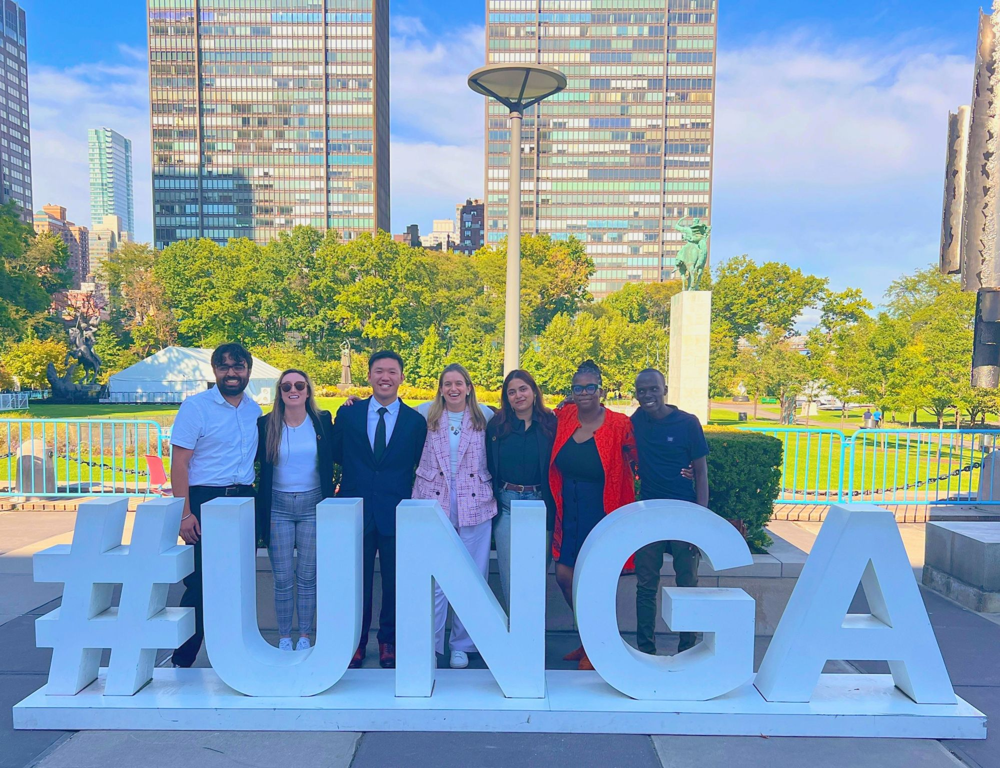

For a more detailed work experience, feel free to head over to the CV section of my website 🙂 

## International Programs
- **We Are Family Foundation** United Nations General Assembly (UNGA 79) Delegate (New York City, United States, 2024)

- **Columbia University** *Global Collaboratory Fellowship* - partnered with Litro de Luz, a Brazilian organization that provides sustainable lighting solutions and developed a compelling pitch deck to increase funding opportunities for the organization's growth and outreach  (Virtual/New York City, United States, 2023)
- **Emory University** Laney Graduate School Summer Opportunity for Academic Research (LGS SOAR) is a 10-week summer research fellowship program for undergraduate students from underrepresented backgrounds (Atlanta, United States, 2022)
- **TechCamp Kochi** Invited by the US Consulate General Chennai to attend an all-expense-paid innovation and technology-based workshop on ocean sustainability (Kochi, India, 2022)
- **University of Oxford** Participated in the University of Oxford Government Outcomes Lab's Hack and Learn event and populated INDIGO Lab's Impact Bond Dataset to enable better data insights on the alignments between social outcome metrics and SDGs (Virtual, 2021)
- **Perimeter Institute for Theoretical Physics** International Summer School for Young Physicists program as one of the 15 international students (and 30 students overall) with a full scholarship (Waterloo, Canada, 2019)
- **Yale University** Yale Young Global Scholars program in Applied Science and Engineering (ASE) with a near-full scholarship. I completed a capstone project on Cleaning Ocean Garbage Debris and was selected as one of the ten speakers for the YYGS ASE and IAS Speaker Series held at Yale Law School (New Haven, United States, 2018)
- **The New York Academy of Sciences** Collaborated with international students and co-developed twelve STEM projects. Notable projects include a device to non-invasively determine micronutrient levels, a smart green skyscraper, predictive data analytics for optimizing barley yield, and a novel data-driven intervention model to combat malnutrition in India. Grand winner of three international innovation challenges and a finalist in four challenges. Invited to New York City and Florida on all-expenses-paid trips two years in a row to present these projects to eminent personalities including Nobel Laureates and CEOs of Fortune 500 companies (New York, United States, 2016-2020)

## Speaking Engagements
- **Sustainable Energy for All:** One of the speakers on the *“Mainstreaming Gender & Youth for SDG7: Challenges and Opportunities for Young Women Entering the Workforce”* panel during the 79th United Nations General Assembly (New York City, United States, 2024) 
- **NASA South/Southeast Asia Research Initiative Meeting:** Presented a poster on *Automated Coastline Extraction from Satellite Imagery using Machine Learning Techniques* (New Delhi, India, 2024)
- **[Imperial College London - Grantham Institute for Climate Change and the Environment](https://www.imperial.ac.uk/grantham/education/science-and-solutions-for-a-changing-planet-dtp/external-engagement/women-in-stem-seminar-series/)** One of four youth activists and speakers on *“Women in STEM Seminar: Public Engagement with Climate Science"* (Virtual, 2021)
- **Intrepid Sea, Air, and Space Museum** GOALS for Girls Summer Technology and Engineering Program (Virtual, 2021)
- **Youthtopia World** Co-hosted a workshop on "Invention for Change" (Virtual, 2021)
- **MAKERS Conference, India:** One of the speakers on the *"STEM Mindset: The Key to A Better Future for Girls in India"* panel (Virtual, 2021)
- **Dawson Summer Initiative (DSI)** Virtual inaugural speaker for DSI in Boulder, Colorado (Virtual, 2021)
- **Global Awareness Movement** Panel on Climate Change and Climate Justice (Virtual, 2020)
- **Global Innovation and Youth Leaders Summit** Delivered a keynote on *“Navigating the Innovation and Changemaking Spheres as a BIPOC Woman in STEM”* (Virtual, 2020)
- **Kyoorius Designyatra 2019** Youngest among 26 speakers at India’s largest design and innovation conference; spoke about design thinking and sustainable design. Shared the stage alongside accomplished designers like David Carson, Timothy Goodman, and Paul Sahre (Goa, India, 2019)

